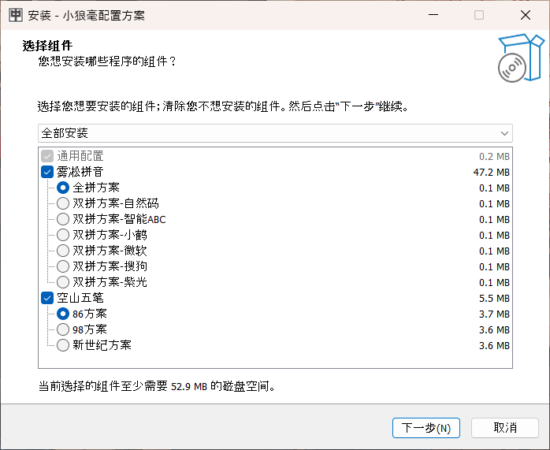

# 小狼毫配置方案整合包

整合了[雾凇拼音](https://github.com/iDvel/rime-ice)和[空山五笔](https://github.com/mrshiqiqi/rime-wubi)方案，做到了配置方案的一键安装，为初入中州韵输入法的小白提供便利。

## 软件特性

- 可选安装雾凇拼音支持的所有版本拼音和双拼方案
- 可选安装空山五笔支持的所有版本五笔方案
- 可以使拼音方案与五笔方案共存，在输入法内切换

## 系统需求

- Windows操作系统
- 已安装小狼毫输入法

## 项目预览

## 开源许可

本项目采用GPLv3许可证，详见[LICENSE](LICENSE.md)文件。
